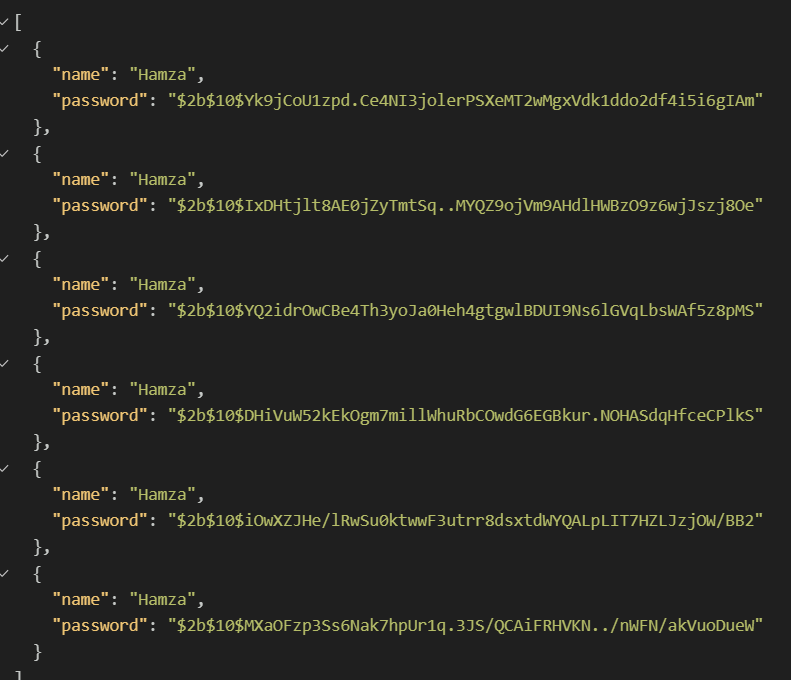

# Simple Node.js User Authentication



Secure user authentication system built with **Node.js**, **Express**, and **bcrypt**, enabling registration and login using hashed passwords for enhanced credential security.
---
Credits --> WebDevSimplified for providing learning materials.

## 🛠 Tools Used

- [Node.js](https://nodejs.org/)
- [Express.js](https://expressjs.com/)
- [bcrypt](https://github.com/kelektiv/node.bcrypt.js)
- [nodemon](https://github.com/remy/nodemon) *(for development)*

---

## 📦 Requirements

- Node.js (v14+)
- npm

---

## 🚀 Installation

```bash
git clone https://github.com/your-username/your-repo.git
cd your-repo
npm install
